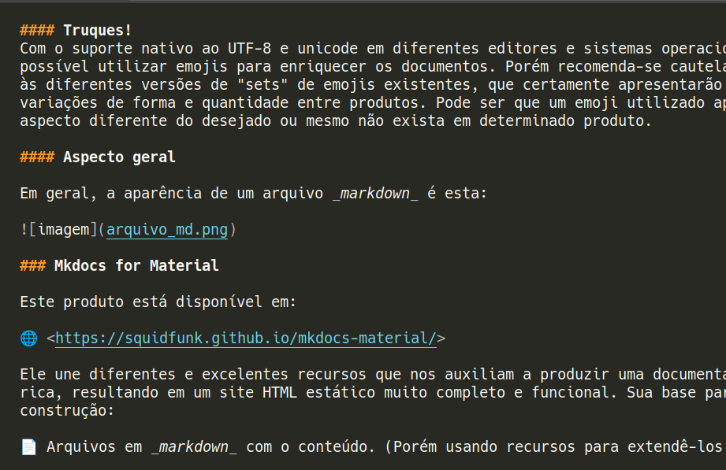

# Markdown + Mkdocs for Material

## Objetivo

O objetivo deste documento é exemplificar a utilização de **Markdown** para produção de documentações, associado ao uso de **Mkdocs for Material** para gerar um site estático que pode ser hospedado em qualquer servidor web de sua preferência

## Introdução

### Markdown

Conforme registro na Wikipédia:

> Markdown é uma linguagem simples de marcação originalmente criada por John Gruber e Aaron Swartz. 
> 
> Markdown converte seu texto em HTML válido. Markdown é frequentemente usado para formatar arquivos README, para escrever mensagens em fóruns de discussão online e para criar rich text usando um editor de texto simples.

Atualmente, o suporte a Markdown está presente nos mais diversos editores de código. Eventualmente uma extensão pode ser necessária em caso de editores muto especializados ou muito simples. Normalmente não é necessário instalar interpretadores ou semelhantes no sistema operacional.

A sintaxe é bem simples comparada a HTML e tem como foco propiciar uma formatação básica a um texto, mantendo ao máximo sua "morfologia" (sem a necessidade alterá-lo de forma a descaracterizá-lo como texto e transformando-o em um código-fonte)

Com isso é possível escrever, ler e manter um arquivo _markdown_ diretamente num editor de código. A extensão padrão de um arquivo _markdown_ é ".md" 

Documentação "histórica" em:

🌐 <https://daringfireball.net/projects/markdown/>

Obs.: Neste portal o autor sugeria o uso de um script Perl para implementar suporte ao Markdown, o que era necessário conforme o propósito de utilização - porém desnecesserário para o uso trivial.

Porém existem diveras documentações on-line disponíveis, e uma boa referência pode ser encontrada em:

🌐 <https://www.markdownguide.org/>

Para ampliar os recursos presentes no _markdown_ é comum que sejam criadas especializações, colocados elementos adicionais por desenvolvedores de editores, ferramentas wiki e repositórios de código. Por exemplo, o suporte a _syntax highlight_ em trechos de código - que não está presente na especificação original, mas é utilizado por diversas ferramentas. Assim é possível encontrar aquivos .md que podem apresentar um resultado "mais rico", dependedo do contexto em que foram produzidos e utilizados.

Outro recurso presente em diversos editores é a possíbilidade de mesclar HTML junto com o _markdown_, para obter formatações mais complexas.


#### Vantagens 
1. Fácil utilização.
2. Fácil compreensão.
3. Muitas ferramentas com suporte.
4. Possibilidade de gerar: HTML, PDF etc. através de ferramentas.
5. Bom para documentações técnicas.

#### Desvantagens
1. Semelhante a um arquivo HTML, não incorpora elementos como gráficos e imagens: estes estarão sempre em arquivos independentes.
2. Devido a simplicidade não apresenta recursos para formatação mais complexas, como textos coloridos, cores de fundo, fontes diferentes, links com atributo _blank etc.
3. Quando utilizado em sua versão _standard_, para uma melhor visualização recomenda-se manter um padrão de 80 caracteres em blocos de código e citações.

#### Truques!
Com o suporte nativo ao UTF-8 e unicode em diferentes editores e sistemas operacionais, é possível utilizar emojis para enriquecer os documentos. Porém recomenda-se cautela devido às diferentes versões de "sets" de emojis existentes, que certamente apresentarão variações de forma e quantidade entre produtos. Pode ser que um emoji utilizado apresente aspecto diferente do desejado ou mesmo não exista em determinado produto.

#### Aspecto geral

Em geral, a aparência de um arquivo _markdown_ é esta:



### Mkdocs for Material

Este produto está disponível em:

🌐 <https://squidfunk.github.io/mkdocs-material/>

Ele une diferentes e excelentes recursos que nos auxiliam a produzir uma documentação rica, resultando em um site HTML estático muito completo e funcional. Sua base para construção:

📄 Arquivos em _markdown_ com o conteúdo. (Porém usando recursos para extendê-los)

🔧 **MKDocs**: um programa python que gera sites estáticos a partir do _markdown_

🌐 <https://www.mkdocs.org/>

🖍**Material**: um conjunto de recursos de design criados pelo Google para produção de sites web.

🌐 <https://material.io>


## Instalação

### Dependências

- Python 3.8 ou superior
- um editor de texto com suporte ao _markdown_

### Procedimento

Em um diretório de trabalho, crie um virtualenv para utilização e instale o produto
```bash
# o virtualenv é um ótimo recurso para isolar a instalação 
# das dependências, sem a necessidade de adicionar ou python 
# alterar bibliotecas do sistema operacional. Podendo ser 
# destruído e gerado novamente do zero, se necessário.
python3 -m venv env_mkdocs_material

# uma vez gerado, basta ativá-lo.
source env_mkdocs_material/bin/activate

# instalando as dependências
pip install --upgrade pip wheel
pip install mkdocs-material

```

## Tutorial

Com o virtualenv ativado, crie um novo projeto
```bash
mkdocs new exemplo
```
O conteúdo resultante será:

```bash
❯ tree exemplo
exemplo
├── docs
│ └── index.md
└── mkdocs.yml

1 directory, 2 files
```
Com isto, copie os arquivos _'README.md'_ e _'imagem_md.png'_ que representam esta própria documentação para o diretório _'docs'_, substituindo o conteúdo do arquivo auto gerado 'index.md' pelo 'README.md'.

Então, para configuração incial, ajuste o arquivo mkdocs.yml para o seguinte conteúdo:

```yaml
site_name: Documentação
theme:
  name: material
  palette: 
    primary: blue grey

markdown_extensions:
  - pymdownx.highlight:
      anchor_linenums: true
  - pymdownx.inlinehilite
  - pymdownx.snippets
  - pymdownx.superfences
```

Para testar, execute um servidor de desenvolvimento

```bash
# servidor de desenvolvimento
mkdocs serve
```

Por fim, se estiver satisfeito com o resultado, você pode gerar um site com:
```bash
# comando de construção
mkdocs build
```
e copiar o conteúdo do diretório _'site'_ para um servidor web de sua preferência.


#### Modificações

Sempre que for realizar modificações

1. Ative o virtualenv
2. Rode o servidor de desenvolvimento
3. Observe as alterações enquanto desenvolve
4. Construa o site novamente, substituindo os arquivos no destino


Você pode explorar outras configurações visitando a documentação oficial: 
🌐 <https://squidfunk.github.io/mkdocs-material/setup/changing-the-colors/>

- explore customização de temas
- explore uso de gráficos com bibliotecas js incorporadas
- use ícones com bibliotecas incorporadas
- explore recursos de pesquisa em arquivos estáticos

Todas as configurações serão inseridas no arquivo _'mkdocs.yml'_

Se necessário, visite também a página da ferramenta base *Mkdocs*:
🌐 <https://www.mkdocs.org/user-guide/writing-your-docs/>


## Outras alternativas

Caso o uso do mkdocs-material não seja uma alternativa viável, é possível aproveitar o arquivo ".md" :

- Usando diretamente, visualizando o resultado em tela através de editores como [Mark Text](https://github.com/marktext/marktext)
- Utilizar outros geradores de sites estáticos como [Jekyll](https://jekyllrb.com/), [Sphinx](https://www.sphinx-doc.org), [Docusaurus](https://docusaurus.io) etc.
- Hospedar em ferramentas como Github [Exemplo]<https://github.com/zeandrade/tutorial_mkdocs_material>
- Adequar e utilizar o conteúdo em wikis
- Através de outras ferramentas, converter para HTML ou rst
